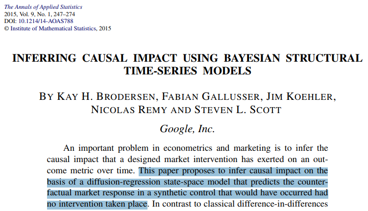
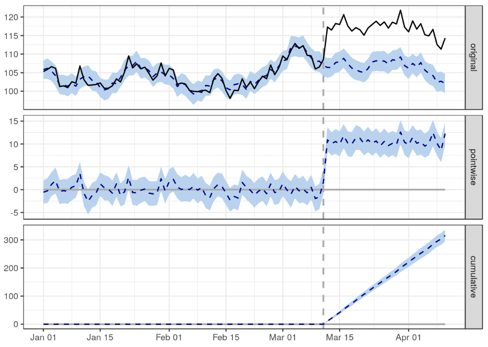
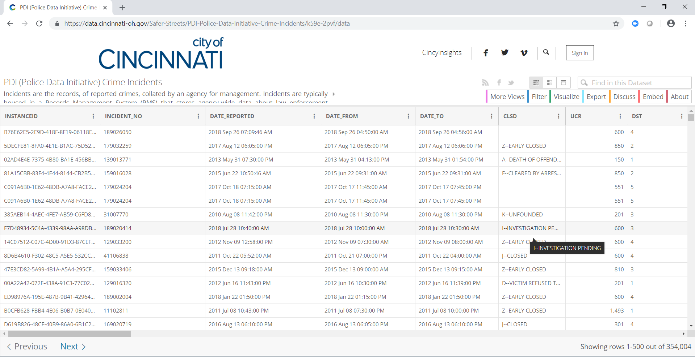

```{r setup, include=FALSE}
knitr::opts_chunk$set(echo = F, cache = T, warning = F, message = F)

library(tidyverse)
library(knitr)
library(kableExtra)
library(lubridate)
library(tsibble)
library(data.table)
library(dtw)
library(bsts)
library(CausalImpact)
library(MarketMatching)
library(ggplot2)
```


----

The slides at:
https://github.com/epspi/CIN-DAY_RUG_02.20.2019

----

## Agenda
- Discussion: what's your workflow for analyzing interventions?
- The building blocks (**bsts**, **CausalImpact**, and **dtw**)
- Demo time (**MarketMatching**)


----

<iframe width="100%" height="500" src="https://www.youtube.com/embed/z1VaYGj0DIo" frameborder="0" allow="autoplay; encrypted-media" allowfullscreen></iframe>

----


## Inference using <b class="purple">CausalImpact</b>



## Potential Outcomes

This analysis of interventions in an observational setting uses the idea of **potential outcomes** (see [Rubin Causal Model](https://en.wikipedia.org/wiki/Rubin_causal_model).


Fit a baseline forecast to predict the **counterfactual**, i.e., how the response variable would have evolved after the intervention if the intervention had never occurred.

---- 



## Credible intervals for impact

```
## Posterior inference {CausalImpact}
## 
##                          Average        Cumulative  
## Actual                   117            3511        
## Prediction (s.d.)        107 (0.37)     3196 (11.03)
## 95% CI                   [106, 107]     [3174, 3217]
##                                                     
## Absolute effect (s.d.)   11 (0.37)      316 (11.03) 
## 95% CI                   [9.8, 11]      [294.9, 337]
##                                                     
## Relative effect (s.d.)   9.9% (0.35%)   9.9% (0.35%)
## 95% CI                   [9.2%, 11%]    [9.2%, 11%] 
## 
## Posterior tail-area probability p:   0.001
## Posterior prob. of a causal effect:  99.9%
## 
## For more details, type: summary(impact, "report")
```

----

### Assumptions

* a **synthetic baseline** forecast can be constructed based on similar time series
* the relationship between the similar time series and the intervention-treated time series does not change after the intervention (static regression)
* the synthetic baseline is not affected by the intervention (none of the inputs that go into making a baseline -- i.e. similar time series -- are touched by the intervention)


## Forecasting a baseline 


## Simplest <b class="purple">bsts</b> model
 


The **local level model** is a random walk observed with noise  

* a **forecasting** equation and a **smoothing** equation
* two sources of error

 
## Customize the structure


* Structural model with a linear trend, seasonality, and regressors
* **Spike & Slab** priors on the regressors perform variable selection for free

----

### How do you choose the predictors?

- Business logic (cumbersome and fickle)
- Correlation (size not considered)
- Euclidian distance (affected by slight time misalignments)
- Dynamic Time Warping (**dtw**)

## A timeless (old?) approach


* Original DTW algorithm by [Sakoe and Chiba (1978)](https://www.irit.fr/~Julien.Pinquier/Docs/TP_MABS/res/dtw-sakoe-chiba78.pdf)
* Came out of speech recognition community
* Many variations and enhancements
* Now popular as general purpose time series clustering method ([Berndt & Clifford 1994](https://www.aaai.org/Papers/Workshops/1994/WS-94-03/WS94-03-031.pdf))


## Controls matching using <b class="purple">dtw</b>

>Dynamical Time Warping finds the best **alignment** between two time series 
>by stretching or compressing them along the time dimension 


---- 

Find the **warping path** that minimizes the **total distance**


## Convenient workflow using <b class="purple">MarketMatching</b>

1. Pre-screening step: Uses `dtw` along with correlations to cull the list of controls condidates
2. Inference step: Dispatches `CausalImpact` with some defaults and produces tons of diagnostics

## <b class="pink">Demo Time!</b> 

---- 

### ... with a little local crime



[Cincinnati PDI (Police Data Initiative) Crime Incidents](https://data.cincinnati-oh.gov/Safer-Streets/PDI-Police-Data-Initiative-Crime-Incidents/k59e-2pvf/data)

## Fetch and wrangle

```{r echo=TRUE, message=FALSE, warning=FALSE}
data_file <- "data/crimes.csv"
data_url  <- "https://data.cincinnati-oh.gov/api/views/k59e-2pvf/rows.csv?accessType=DOWNLOAD"

# Download data if not already in place
if (!file.exists(data_file)) download.file(data_url, data_file)

# Read in data and count incidents by date
# Filter to 2011 onwards and only for valid neighborhoods
daily <- fread(data_file) %>% 
  .[, .(incidents = .N)
    , .(date = as_date(mdy_hms(DATE_REPORTED)), hood = SNA_NEIGHBORHOOD)] %>% 
  .[date %between% c('2011-01-01', '2017-12-31') & hood != "N/A", ]
```

----

Using `tsibble`, aggregage by year-month and pad to ensure no **implicit** missing values 

```{r, echo=TRUE}
monthly <- daily %>% 
  as_tsibble(., key = id(hood)) %>% 
  group_by_key(.) %>% 
  index_by(month = yearmonth(date)) %>% 
  summarise(incidents = sum(incidents)) %>% 
  fill_gaps(., incidents = 0L, .full = TRUE)
  
glimpse(monthly)
```


## Crime varies widely (<b class="purple">surprise?</b>)

```{r}
data.table(monthly)[, .(mean = mean(incidents), .N), by = hood] %>% 
  arrange(hood)
```

Most importantly all neighborhoods have the same number of records, since our time series need to be of **equal length**


## What if Madtree is bringing crime to Oakley?


----

### Monthly incidents in Oakley

```{r}
p <- monthly %>% 
  filter(hood == "OAKLEY") %>% 
  ggplot(aes(x = month, y = incidents)) +
  geom_line(color = rgb(0, 170, 255, maxColorValue = 255), size = 1) +
  geom_vline(xintercept = yearmonth("2017-03-01"), 
             color = rgb(255, 0, 136, maxColorValue = 255), size = 1.5) +
  scale_x_date(date_labels = "%Y", position = "top",
               date_breaks = "1 year") +
  labs(y = NULL, x = NULL) +
  theme_minimal()

p
```


## Control candidates

```{r warning=FALSE, echo=TRUE}
m <- as_tibble(monthly) %>% 
  best_matches(., 
               id_variable           = "hood",
               date_variable         = "month",
               matching_variable     = "incidents",
               markets_to_be_matched = "OAKLEY",
               start_match_period    = "2011-01-01",
               end_match_period      = "2017-02-28")

m$BestMatches
```


## Inference

```{r echo=TRUE, eval = F}
proof <- inference(matched_markets = m, 
                   test_market     = "OAKLEY",
                   end_post_period = "2019-01-01")

proof$CausalImpactObject
```

```{r include=FALSE}
proof <- inference(matched_markets = m, 
                   test_market     = "OAKLEY",
                   end_post_period = "2019-01-01",
                   analyze_betas   = TRUE)
```

```{r}
proof$CausalImpactObject
```

## Potential outcomes 

```{r}
proof$PlotActualVersusExpected
```

## Cumulative difference

```{r}
proof$PlotCumulativeEffect
```


## Oakley vs similar crime "markets"

```{r}
proof$PlotActuals 
```

## Diagnostics on the error prior

```{r}
proof$PlotPriorLevelSdAnalysis
```

## The End